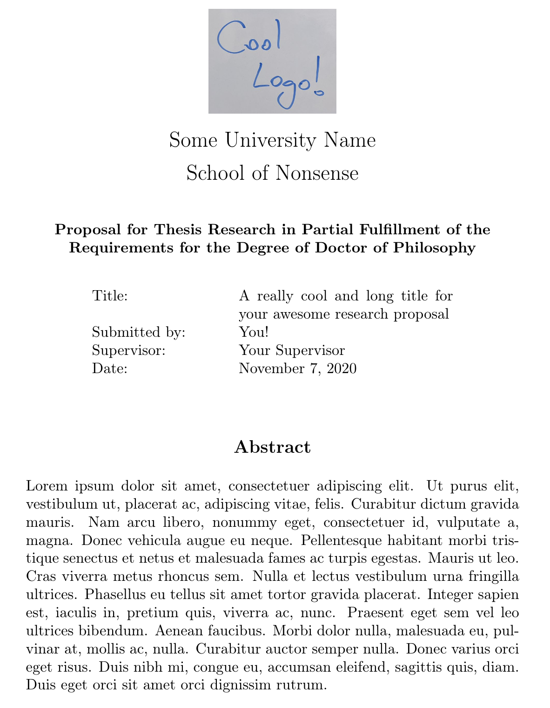

# Latex PhD Research Proposal Template


* A simple Latex template for PhD research proposals.
* Easy to customize: add your details as variables, and even your university logo.





## Installation

Download this GiuHub repository as a zip (button on top).
### Installing in Overleaf
2. Upload the .cls and .sty files to your Overleaf project.

That's it!

### Installing locally
Here are a few tips on installing the .cls and .sty file locally:
https://tex.stackexchange.com/questions/1137/where-do-i-place-my-own-sty-or-cls-files-to-make-them-available-to-all-my-te

## Usage

After installation, set your class:
```
\documentclass{phd_proposal}
```

### Class options

Add as many as you want.

#### Wider margins

Need more room for for your text? No worries, just use the 'widemargins' option!
```
\documentclass[widemargins]{phd_proposal}
```

#### Remove figures
Some universities limit the length of a research proposal, not including figures. 
Using the "draft" option allows you to recompile without the figures.

```
\documentclass[draft]{phd_proposal}
```


#### New page
If you want your actual text to start after the cover page, add the "newpage' option:

```
\documentclass[newpage]{phd_proposal}
```


### Must-have variables
```
\title{your proposal title}
\author{your name}
\supervisor{your supervisor's name}
\institution{the name of your university}
\school{your school / faculty name}
```

### Features
#### Adding a logo

Adding your university of faculty logo is easy. Simply use the following variables:
```
\logo{png} % Optional. The logo file should be named 'logo' and be located in the 'figures' folder. The value is the format of the file (could be JPG, PNG,...)
\logowidth{0.2} % Optional, only works if the 'logo' variable is given. The value is the ratio between the width of the logo and total text width. Default value is 0.1.
```